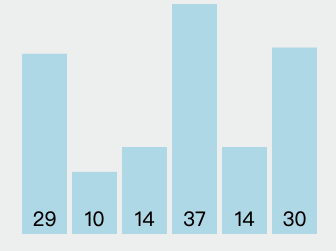
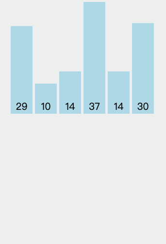
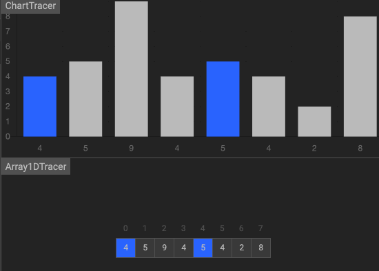
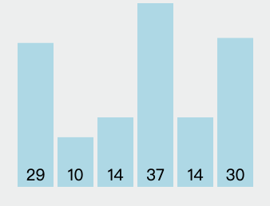
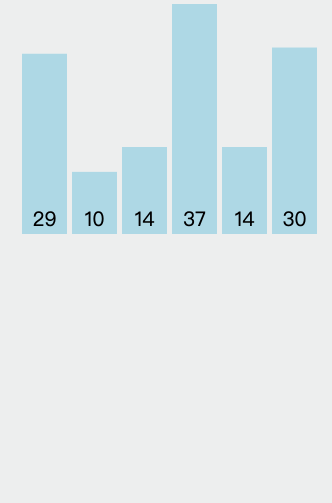
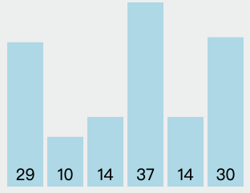
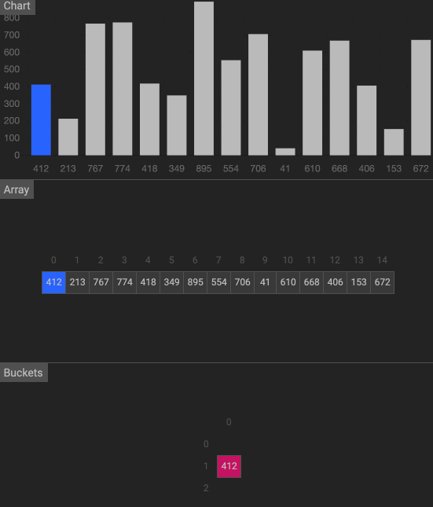
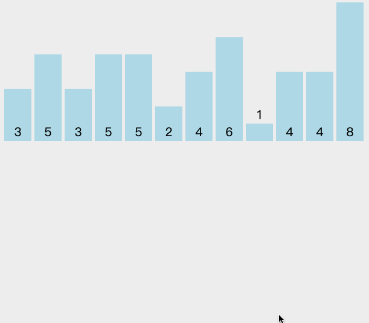
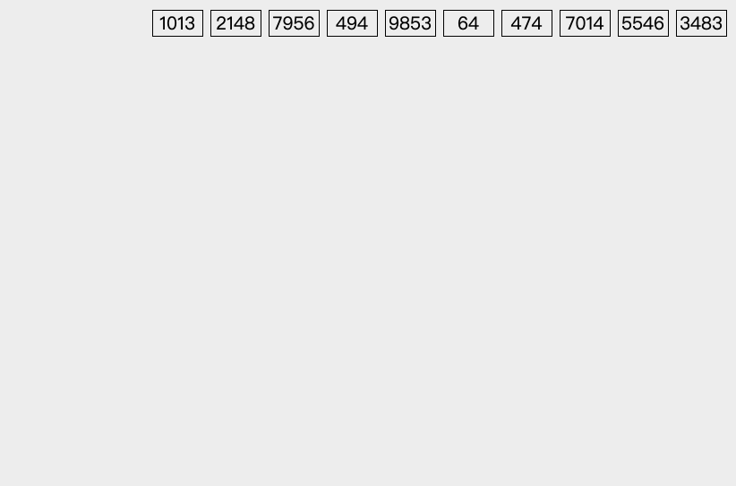

# 排序
最经典、最常用的排序算法：
* 冒泡排序
* 插入排序
* 希尔排序
* 选择排序
* 归并排序
* 快速排序
* 堆排序
* 桶排序
* 计数排序
* 基数排序

如何分析一个算法，可以从以下几个角度：
* 最好情况、最坏情况、平均情况时间复杂度：原始数据的有序性
* 空间复杂度
* 排序算法的内存消耗：是否是原地排序，原地排序算法，就是特指空间复杂度是 $$ O(1)$$  的排序算法
* 排序算法的稳定性：稳定性就是待排序的序列中存在值相等的元素，经过排序之后，相等元素之间原有的先后顺序不变

| 排序算法    | 平均时间复杂度 | 最好情况  | 最坏情况   | 空间复杂度      | 原地排序|稳定性|
| :---:| :-----------------:| :-----------------:| :-----------------:| :-----------------: |:-----------------: |:--------:|
|冒泡排序|$$ O(n^{2})$$| $$ O(n)$$ | $$ O(n^{2})$$ | $$ O(1)$$ | 原地排序 | 稳定 |
|插入排序| $$ O(n^{2})$$| $$ O(n)$$ | $$ O(n^{2})$$ | $$ O(1)$$ | 原地排序 | 稳定 |
|希尔排序| $$ O(nlogn)$$|$$ O(nlog^{2}n)$$|$$ O(nlog^{2}n)$$|$$ O(1)$$|原地排序|不稳定|
|选择排序|$$ O(n^{2})$$|$$ O(n^{2})$$|$$ O(n^{2})$$|$$ O(1)$$|原地排序|稳定|
|归并排序|$$ O(nlogn)$$|$$ O(nlogn)$$|$$ O(nlogn)$$|$$ O(n)$$|非原地|稳定|
|快速排序|$$ O(nlogn)$$|$$ O(nlogn)$$|$$ O(n^{2})$$|$$(nlogn)$$|原地排序|不稳定|
|堆排序|$$ O(nlogn)$$|$$ O(nlogn)$$|$$ O(nlogn)$$|$$ O(1)$$ |原地排序|不稳定|
|桶排序|$$ O(n+k)$$|$$ O(n+k)$$|$$ O(n^{2})$$|$$ O(n+k)$$|非原地|稳定|
|计数排序|$$ O(n+k)$$|$$ O(n+k)$$|$$ O(n+k)$$|$$ O(k)$$|非原地|稳定|
|基数排序|$$ O(n*k)$$|$$ O(n*k)$$|$$ O(n*k)$$|$$ O(n+k)$$|非原地|稳定|

常见的快冒泡排序、速排序、归并排序、堆排序等属于`比较排序`。在排序的最终结果里，元素之间的次序依赖于它们之间的比较。每个数都必须和其他数进行比较，才能确定自己的位置。比较排序适用于一切需要排序的情况。   
计数排序、基数排序、桶排序则属于`非比较排序`。非比较排序是通过确定每个元素之前，应该有多少个元素来排序。非比较排序对数据规模和数据分布有一定的要求。

## 冒泡排序
冒泡排序只会操作相邻的两个元素。   
步骤：  
1. 比较相邻的元素。如果第一个比第二个大，就交换它们。
2. 对每一对相邻元素作同样的工作，从开始第一对到结尾的最后一对。这步做完后，最后的元素会是最大的数。
3. 针对所有的元素重复以上的步骤，除了最后一个。
4. 持续每次对越来越少的元素重复上面的步骤，直到没有任何一对数字需要比较。

## 插入排序
将排序的数据分为两个区间，**已排序区间**和**未排序区间**。初始已排序区间只有一个元素，就是数组的第一个元素。插入算法的核心思想是取未排序区间中的元素，在已排序区间中找到合适的插入位置将其插入，并保证已排序区间数据一直有序。重复上面的步骤，直到未排序区间中元素为空。   
步骤：
1. 从第一个元素开始，该元素可以认为已经被排序
2. 取出下一个元素，在已经排序的元素序列中从后向前扫描；
3. 如果该元素（已排序）大于新元素，将该元素移到下一位置，重复该步骤，直到找到已排序的元素小于或者等于新元素的位置，将新元素插入到该位置。
3. 重复2,3步骤，直到未排序元素为空

## 希尔排序
希尔排序也是一种插入排序，它是简单插入排序经过改进之后的一个更高效的版本，也称为缩小增量排序。  
它与插入排序的不同之处在于，它会优先比较距离较远的元素。这个距离就是增量，一般增量取值从n/2开始，然后一半一半缩小增量，{n/2,(n/2)/2...1}，
对每个增量分组使用插入排序，直到增量减到1时结束。   
步骤：
1. 选择一个增量序列t1，t2，…，tk，其中ti>tj，tk=1
2. 按增量序列个数k，对序列进行k 趟排序
3. 每趟排序，根据对应的增量ti，将待排序列分割成若干长度为m 的子序列，分别对各子表进行直接插入排序。仅增量因子为1时，整个序列作为一个表来处理，表长度即为整个序列的长度

## 选择排序
算是表现最稳定的排序算法之一，平均、最好、最坏的时间复杂度都是 $$ O(n^{2})$$   
步骤：
1. 在未排序序列中找到最小（大）元素，存放到排序序列的起始位置
2. 再从剩余未排序元素中继续寻找最小（大）元素，然后放到已排序序列的末尾
3. 重复2步骤，直到所有元素均排序完毕

## 归并排序
归并排序使用的就是分治思想。分治，就是分而治之，将一个大问题分解成小的子问题来解决。分治算法一般都是用递归来实现的，分治是一种解决问题的处理思想，递归是一种编程技巧。  
步骤：
1. 把长度为n的输入序列分成两个长度为n/2的子序列
2. 对这两个子序列分别采用归并排序(递归)
3. 将两个排序好的子序列合并成一个最终的排序序列
 

## 快速排序
快速排序利用的也是分治思想。基本思路：如果要排序数组中下标从 p 到 r 之间的一组数据，我们选择 p 到 r 之间的任意一个数据作为 pivot(分区点)。将小于 pivot 的放到左边，将大于 pivot 的放到右边，分成两个部分，再对这两个部分重复分区进行排序，以达到整个序列有序。   
步骤：
1. 从数列中挑出一个元素，称为 “基准”（pivot）
2. 重新排序数列，将小于 pivot 的放到左边，将大于 pivot 的放到右边，将 pivot 放到中间
3. 递归地（recursive）把小于基准值元素的子数列和大于基准值元素的子数列排序

## 堆排序
堆排序是指利用堆这种数据结构所设计的一种排序算法。  
步骤：
1. 创建一个堆 H[0……n-1]
2. 把堆首（最大值）和堆尾互换
3. 把堆的尺寸缩小 1，并调用 shift_down(0)，目的是把新的数组顶端数据调整到相应位置
4. 重复步骤 2，直到堆的尺寸为 1

直接上视频：   
 14669281@@420 x 280 

## 线性排序
### 桶排序
桶排序的核心思想，是将要排序的数据分到几个有序的桶里，每个桶里的数据再单独进行排序。    
桶排序对排序数据要求非常高：
1. 排序数据能够容易的划分到m个桶中，桶之间不需要再进行排序，只要排好桶内的顺序
2. 要求每个桶内的数据，都要分布比较均匀  

桶排序比较适合使用外部存储，**例子**：     
有10GB的订单数据，希望按订单金额（假设金额都是正整数）进行排序，但是内存有限，只有几百MB。   
解决思路：假设订单金额是1-10w元，然后将所有订单金额划分到100个桶中，每个桶依次存1-1000元，如果订单金额比较均匀，数据就会均匀的分配到各个桶中。  
如果订单金额不是很均匀，不均匀区间的数据，需要进一步划分桶，尽量做到均匀分布。

步骤：
1. 设置固定数量的空桶
2. 把数据放到对应的桶中，每个桶有不同的区间
3. 对每个不为空的桶中数据进行排序
4. 拼接不为空的桶中数据

### 计数排序
计数排序其实是桶排序的一种特殊情况。当要排序的 n 个数据，所处的范围并不大的时候，比如最大值是 k，我们就可以把数据划分成 k 个桶，每个桶内的数据值都是相同的。  
步骤：
1. 找出待排序的数组中最大和最小的元素
2. 开辟一块新的空间创建新的数组 B，长度为 ( max - min + 1)
3. 数组 B 中 index 的元素记录的值是 A 中某元素出现的次数
4. 最后输出目标整数序列，具体的逻辑是遍历数组 B，输出相应元素以及对应的个数

### 基数排序
基数排序也是非比较的排序算法，对每一位进行排序，从最低位开始排序。基数排序对要排序的数据是有要求的，需要可以分割出独立的“位”来比较。  
步骤：
1. 将所有待比较数值（正整数）统一为同样的数位长度，数位较短的数前面补零
2. 从最低位开始，依次进行一次排序
3. 从最低位排序一直到最高位排序完成以后, 数列就变成一个有序序列

# 参考
* [十大经典排序算法动画与解析](https://mp.weixin.qq.com/s/vn3KiV-ez79FmbZ36SX9lg)
* [数据结构与算法之美](https://time.geekbang.org/column/article/41802)
* [动态图解十大经典排序算法](https://mp.weixin.qq.com/s/HQg3BzzQfJXcWyltsgOfCQ)
* [算法可视化](https://visualgo.net/zh)