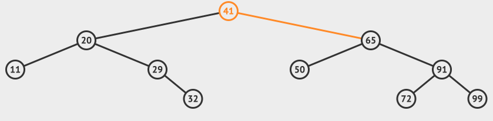
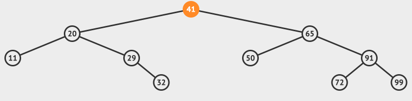
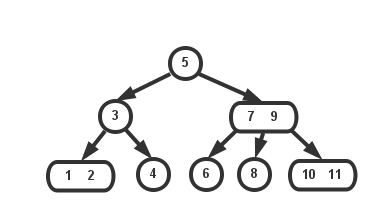

# 二叉树
## 树
  
"树"这种数据结构和我们真实世界的树类似，里面的元素称为"节点"。   
如图所示：   
* 根节点：A(没有父节点的节点)
* 父节点：A是B、C、D 的父节点
* 子节点：B是A的子节点
* 兄弟节点：B、C、D 是兄弟节点
* 叶子节点：K、L、F、G、M、I、J(没有子节点的节点)

树的几个层次概念：  
* 节点的高度：节点到子节点的最长路径(边数)
* 节点的深度：根节点到这个节点所经历的边的个数
* 节点的层数：节点的深度+1
* 树的高度：根节点的高度

盗图说明下   
    

## 二叉树
最常用的就是二叉树，每个节点最多只有两个子节点，左子节点和右子节点。  
   

二叉树还有两个比较特殊的情况：
* **满二叉树**：叶子节点都在最底层，除了叶子节点之外，每个节点都有左右两个子节点

* **完全二叉树**：叶子节点都在最底下两层，最后一层的叶子节点都靠左排列，并且除了最后一层，其他层的节点个数都要达到最大。      

### 实现方式
#### 链式存储法
使用链表实现，每个节点有三个字段，其中一个存储数据，另外两个是指向左右子节点的指针
#### 顺序存储法
使用数组实现，根节点存储在下标 $i=1$ 的位置，那左子节点存储在下标 $2*i=2$ 的位置，右子节点存储在 $2*i+1=3$的位置。堆其实就是一种完全二叉树，最常用的存储方式就是数组
### 遍历
经典的遍历方法有三种，前序遍历、中序遍历和后序遍历
#### 前序遍历
前序遍历是指，对于树中的任意节点来说，先打印这个节点，然后再打印它的左子树，最后打印它的右子树
#### 中序遍历
中序遍历是指，对于树中的任意节点来说，先打印它的左子树，然后再打印它本身，最后打印它的右子树
#### 后序遍历
后序遍历是指，对于树中的任意节点来说，先打印它的左子树，然后再打印它的右子树，最后打印这个节点本身

二叉树的遍历就是一个递归过程，可以使用递归或者非递归来实现。

## 二叉查找树
二叉查找树，也叫二叉搜索树，最大的特点，支持动态数据集合的快速插入、删除、查找操作。  
二叉查找树的特性：
1. 在树中的任意一个节点，其左子树中的每个节点的值，都要小于这个节点的值
2. 右子树节点的值都大于这个节点的值

### 查找
查找从根节点开始，如果要查找的值等于根节点，直接返回；值小于根节点，则在左子树中递归查找；值大于根节点，则在右子树中查找。例如下面查找的节点72

### 插入
插入的值比节点值大，如果右子树为空，则直接插入，如果不为空，则递归遍历右子树，找到插入位置。插入值比节点小，如果左子树为空，则直接插入，如果不为空，则递归遍历左子树，找到插入位置。例如插入节点51

### 删除
删除的情况比较复杂一点，需要分几种情况处理。  
* 如果要删除的节点没有子节点，直接将父节点中，指向该节点的指针设置为null
* 如果只有一个子节点，则将要删除节点的父节点，指向要删除节点的子节点
* 如果要删除的节点，有两个子节点。首先，先找到这个节点的右子树中的最小节点，把它替换到要删除的节点上，然后再删除掉这个最小节点，删除节点可以使用上面的步骤进行。例如删除节点65

### 其他操作
二叉树还支持快速地查找最大节点和最小节点、前驱节点和后继节点。使用中序遍历二叉查找树，可以输出有序的数据序列，时间复杂度是 $O(n)$
### 时间复杂度
时间复杂度其实都跟树的高度成正比，就是 $O(height)$。插入、删除、查找操作的时间复杂度也比较稳定，是 $O(logn)$。
## 红黑树
在理想情况下，二叉查找树的插入、删除、查找操作的时间复杂度是$O(logn)$，在极端情况下，二叉查找树会退化成链表，时间复杂度达到了$O(n)$。为了解决二叉查找树退化的情况，就出现了平衡二叉查找树的概念。   
平衡二叉查找树的定义：二叉树中任意一个节点的左右子树的高度相差不能大于1，这个定义比较严格。下面要讲的红黑树，虽然它不符合我们前面讲的严格的平衡二叉查找树的定义，但是它仍然是合格的平衡二叉查找树
### 定义
   
红黑树(R-B Tree)，需要满足以下几个要求：
* 根节点是黑色的
* 每个叶子节点都是黑色的空节点（NIL），也就是说，叶子节点不存储数据
* 任何相邻的节点都不能同时为红色，也就是说，红色节点是被黑色节点隔开的
* 每个节点，从该节点到达其可达叶子节点的所有路径，都包含相同数目的黑色节点

红黑树背后的实现逻辑是[2-3树](https://www.cnblogs.com/tiancai/p/9072813.html)，如果对2-3树理解了，红黑树理解上就事半功倍。
### 2-3树
  
2-3树是二叉查找树的变种，树中的2和3代表两种节点，以下表示为2-节点和3-节点。  
2-节点即普通节点：包含一个元素，两条子链接
3-节点则是扩充版，包含2个元素和三条链接
#### 查找
查找方式和二叉查找方式类似。  
例如查找上图中的8，首先和根节点5比较，比5大，则右子树中查找。发现右子节点3，是一个3-节点，先与右边9比较，比9小，然后与左边7比较，比7大，查找的节点在3-节点的中间子树中，中间2-节点8就是要查找的节点。
#### 插入
2-3树可以保持平衡，主要在插入时对树进行重新维护。  
维护就是通过2-节点、3-节点以及4-节点之间的转换。  
##### 节点合并
插入结点，就是在2-3树中插入一个2-节点。   
在底部插入一个节点后，就会导致底部“多出”一个节点，导致2-3树不完美平衡，解决方案就是把它与上面的节点合并。
* 在一个2-节点的左边
* 在一个2-节点的右边
* 在一个3-节点的左边
* 在一个3-节点的中间
* 在一个3-节点的右边   

如图所示：    

##### 节点分裂
在节点合并中，会出现4-节点，不过最终的2-3树不能出现4-节点，就需要通过节点分裂，来确保2-3树的平衡性。
   
将4-叉节点从中间分开，并将中间的两个节点分别重新接在a的右子节点和c的左子节点。   
盗图说明下插入的例子，依次插入1-7:  

#### 删除
删除操作比插入操作更加复杂，删除之前，先要对2-3树进行一次命中的查找，查找成功才可以进行删除操作。   
删除节点大概分为3种情形
* 删除非叶子节点
* 删除不为2-节点的叶子节点
* 删除为2-节点的叶子节点

##### 删除非叶子节点
操作步骤：使用中序遍历下的直接后继节点key来覆盖当前待删除节点key，再删除用来覆盖的后继节点key。  

##### 删除不为2-节点的叶子节点
操作步骤：删除不为2-节点的叶子节点，直接删除节点即可   

##### 删除为2-节点的叶子节点
删除为2-节点的叶子节点的步骤相对复杂，删除节点后需要做出相应判断，并根据判断结果调整树结构。主要分为四种情形：
1. **删除节点为2-节点，父节点为2-节点，兄弟节点为3-节点**  

操作步骤：当前待删除节点的父节点是2-节点、兄弟节点是3-节点，将父节点移动到当前待删除节点位置，再将兄弟节点中最接近当前位置的key移动到父节点中。  

2. **删除节点为2-节点，父节点为2-节点，兄弟节点为2-节点**

操作步骤：当前待删除节点的父节点是2-节点、兄弟节点也是2-节点，先通过移动兄弟节点的中序遍历直接后驱到兄弟节点，以使兄弟节点变为3-节点；再进行情况1的操作   
    

3. **删除节点为2-节点，父节点为3-节点** 

操作步骤：当前待删除节点的父节点是3-节点，拆分父节点使其成为2-节点，再将再将父节点中最接近的一个拆分key与中孩子合并，将合并后的节点作为当前节点。    

4. **2-3树为满二叉树，删除叶子节点**

操作步骤：若2-3树是一颗满二叉树，将2-3树层树减少，并将当前删除节点的兄弟节点合并到父节点中，同时将父节点的所有兄弟节点合并到父节点的父节点中，如果生成了4-节点，再分解4-节点。   

### 红黑树的基本思想
2-3树是红黑树背后的实现逻辑，再看下红黑树的几个要求：
1. 根节点是黑色的
2. 每个叶子节点都是黑色的空节点（NIL），也就是说，叶子节点不存储数据
3. 任何相邻的节点都不能同时为红色，也就是说，红色节点是被黑色节点隔开的
4. 每个节点，从该节点到达其可达叶子节点的所有路径，都包含相同数目的黑色节点

在插入、删除节点的过程中，第三、第四点要求可能会被破坏，需要进行一些操作恢复平衡。
### 操作
#### 左右旋转
围绕某个节点的左旋，也叫逆时针旋转；围绕某个节点的右旋，也叫顺时针旋转   

#### 改变颜色
红黑树插入的节点必须是红色的。而且，二叉查找树中新插入的节点都是放在叶子节点上。  
如同在2-3树中一样，红黑树要能够处理4-节点。   
对于4-节点，我们只有两种操作：合成一个4-节点和分解一个4-节点。 

反色操作会将两个子节点的父节点变为红色
### 插入
新节点插入之后，如果红黑树的平衡被打破，那一般会有下面三种情况：
1. 调整右边的红链接   

如果某个节点的左子节点是黑色但右子节点是红色时，我们要将右边的红色链接转到左边来，直接通过左旋操作
   
2. 分解4-节点

如果节点的左右子节点都是红色时，就代表着一个4-节点，为此我们可以直接将其反色来分解它  
  

3. 连续的红色左儿子 

  
连续的两个红色左子节点也将表示一个4-节点，通过右旋操作，可以变成情况2

### 删除
红黑树插入操作的平衡调整还不是很难，但是它的删除操作的平衡调整相对就要难多了。  
删除操作的平衡调整分为两步，第一步是针对删除节点初步调整，第二步是针对关注节点进行二次调整，让它满足红黑树的第三条定义。  
#### 红节点的转移
由于红黑树在向下递归的过程中只有向左边和向右两个方向，因此我们再弄两个操作：红色左移和红色右移。 
第一种情况：  
第一种情况是右子节点不是3-节点，我们直接在左子节点处创建4-节点：  

另一种情况是右子节点是一个3-节点，那么操作就比较复杂：

#### 处理根节点
和2-3树一样，根节点可能为2-节点。   
    
a是真正的根节点，而\infty∞是一个想象的节点，实际上不存在。这样根节点就变成了一个3-节点。直接将根节点设为红色即可。当删除操作完成后，再把根节点设为黑色。

#### 真正的删除
红黑树的删除过程和二叉搜索树类似。首先都要在树中找到这个节点，然后再着手处理。   
对于红黑树，它的节点也是要么都是空，要么就没有。  
* 对于没有子节点的节点，在保证向下递归的红色节点的变换完成之后，如果它是红节点，我们可以直接将其删除。如果不是红节点，那么它的左子节点必定是红色节点，因为我们保证它会在一个3-节点或4-节点中，并且我们的红色转移操作都是创建红链接在左的节点。这样我们可以直接将其顺时针旋转，使其变为红色节点，然后直接删除。
* 对于有子节点的节点，我们模仿二叉搜索树中的做法：在它的右子树中找到最小的节点来替代它的位置，然后在右子树中将这个节点删除即可。

## 总结
* 把红黑树的平衡调整的过程比作魔方复原，不要过于深究这个算法的正确性
* 找准关注节点，不要搞丢、搞错关注节点
* 插入操作的平衡调整比较简单，但是删除操作就比较复杂

# 参考
* [红黑树](https://zh.wikipedia.org/wiki/%E7%BA%A2%E9%BB%91%E6%A0%91)
* [2-3树与红黑树](https://riteme.site/blog/2016-3-12/2-3-tree-and-red-black-tree.html)
* [数据结构与算法——2-3树](https://www.cxyxiaowu.com/1566.html)
* [多动态图详细讲解二叉搜索树](https://lufficc.com/blog/binary-search-tree)
* [清晰理解红黑树的演变---红黑的含义](https://www.cnblogs.com/tiancai/p/9072813.html)
* [算法可视化](https://visualgo.net/zh)
* [学习算法和刷题的思路指南](https://labuladong.gitbook.io/algo/di-ling-zhang-bi-du-xi-lie/xue-xi-shu-ju-jie-gou-he-suan-fa-de-gao-xiao-fang-fa)